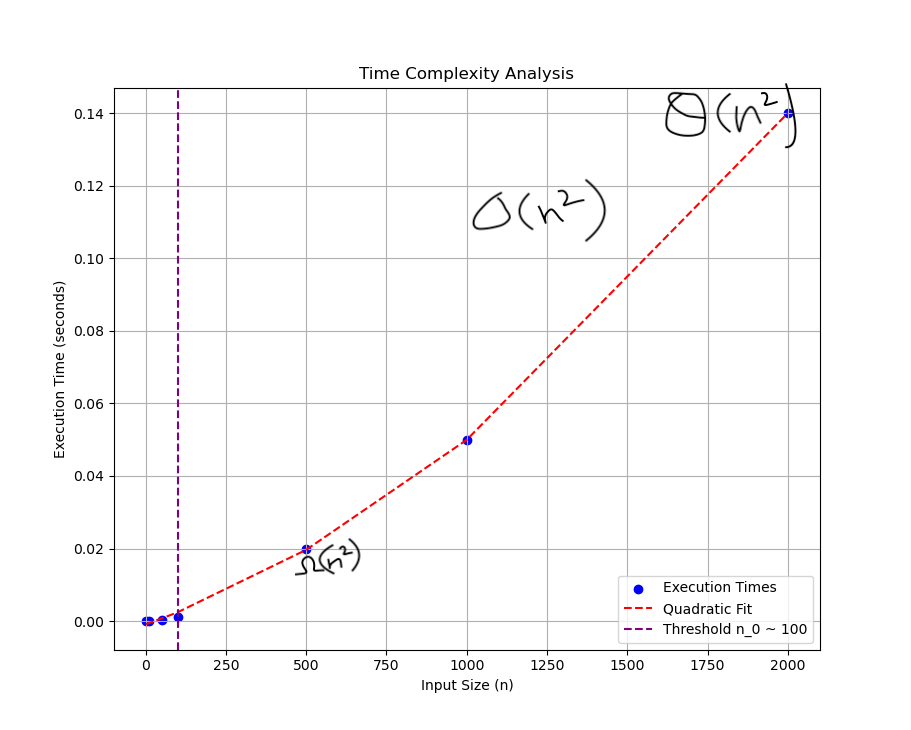
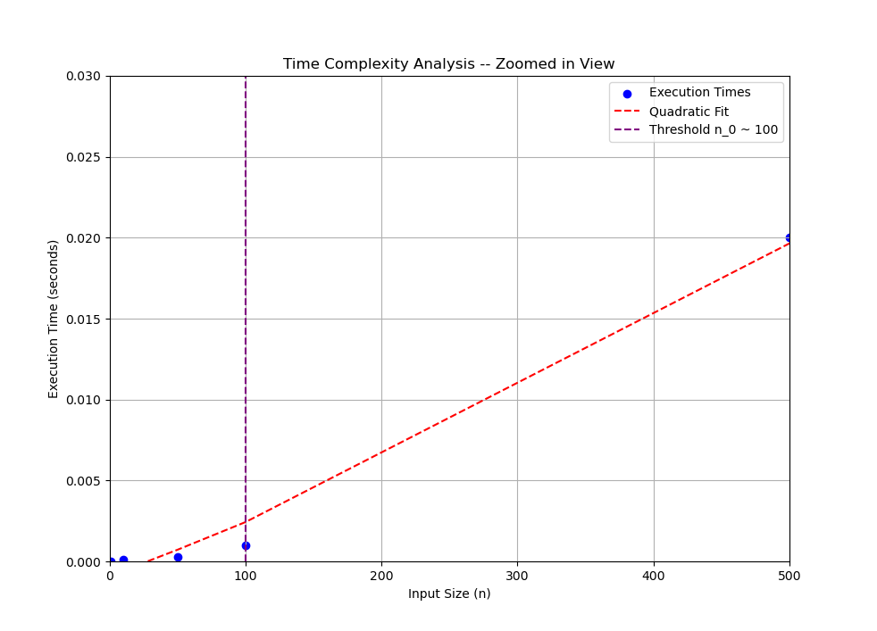

# Analysis of Algorithms and their Time Complexity

## 1. Find Algorithm's Runtime, using Summation

To determine the runtime of the algorithm, we'll mathematically express the time complexity by counting the number of basic operations and using summation notation.

Here is the pseudocode representation of the given function:

```matlab
function x = f(n)
    x = 1;
    for i = 1:n
        for j = 1:n
            x = x + 1;
```

The basic operation in this case is `x = x + 1`, which is executed inside the inner loop.

### Step 1: Loop Analysis
- The outer loop runs from `i = 1` to `i = n`, so it executes `n` times.
- The inner loop runs from `j = 1` to `j = n` for each iteration of the outer loop. So, for each of the `n` iterations of the outer loop, the inner loop executes `n` times.

Total number of loop executions = product of the loop bounds

$$
\text{Total operations} = \sum_{i=1}^{n} \sum_{j=1}^{n} 1
$$


### Step 2: Summation
Inner summation:
$
\sum_{j=1}^{n} 1 = n
$

Outer summation:
$
\sum_{i=1}^{n} n = n \times n = n^2
$

The total number of operations is $ n^2 $. Therefore, the time complexity of the algorithm is: $ T(n) = O(n^2) $

This quadratic runtime arises because the nested loops each run $n$ times.

## 2. Plot "Time vs n"
### Benchmark Environment

- **Operating System**: macOS 14.4.1
- **Processor/Chip**: Apple M2 Pro (10-core CPU)
- **RAM**: 8 GB
- **Storage**: 1TB GB Macintosh HD
- **Python Version**: 3.12.0
- **Dependencies**: `matplotlib`


## 3. $O$, $\Omega$, and $\Theta$ Notation

### $O$ (Upper Bound)

**Big-O** notation provides the **upper bound** on the growth rate of an algorithm's runtime. It describes the worst-case scenario, giving an estimate of how the runtime will scale with the input size.

For the given function, both loops iterate from `1` to `n`, resulting in \(n^2\) iterations in the worst case.

Thus, the **upper bound** of the function is:

$$
T(n) = O(n^2)
$$

This implies the runtime will not exceed \(n^2\) and **Big-O** reflects the worst-case time complexity.

---

### $\Omega$ (Lower Bound)

**Big-Omega (Ω)** notation represents the **lower bound** on the algorithm's growth rate, indicating the best-case scenario for the runtime.

In this function, the two loops always execute exactly \(n^2\) iterations, even in the best case. Therefore, the time complexity remains quadratic.

Thus, the **lower bound** of the function is:

$$
T(n) = \Omega(n^2)
$$

This means the function will always require at least \(n^2\) steps to complete, regardless of the input specifics.

---

### $\Theta$ (Tight Bound)

**Big-Theta (Θ)** notation provides a **tight bound** on the runtime, indicating that the function's growth rate is both upper and lower bounded by \(n^2\). 

Since both the upper and lower bounds of the function are \(n^2\), the time complexity is:

$$
T(n) = \Theta(n^2)
$$

This signifies that the runtime grows exactly at the rate of \(n^2\) in both the worst and best cases.

---

### Result
- **Big-O (Upper Bound)**: $O(n^2)$
- **Big-Omega (Lower Bound)**: $\Omega(n^2)$
- **Big-Theta (Tight Bound)**: $\Theta(n^2)$

### Plot



This analysis confirms that the time complexity of the algorithm is quadratic, and the runtime grows proportionally to \(n^2\) in all cases.

## 4. Determining n0



### 4. Will This Increase How Long It Takes the Algorithm to Run (e.g., timing the function like in #2)?

Yes, introducing the operation `y = i + j` within the inner loop results in a slight increase in runtime. This is because `y = i + j` is a constant-time operation $O(1)$, which adds a small overhead for each iteration.

Despite this additional operation, it does not change the algorithm’s overall time complexity. The nested loops continue to execute $n^2$ times, keeping the time complexity at:

$$ T(n) = O(n^2) $$

In conclusion:
- **Yes**, the runtime is slightly affected by the new operation, but the overall growth rate remains quadratic.

---

### 5. Will It Affect Your Results from #1?

No, the modification does not alter the results from Question 1. In Question 1, we established that the time complexity was $O(n²)$ due to the two nested loops, each running n times. The addition of the operation `y = i + j`, which is a constant-time operation $O(1)$, introduces only a minor overhead in each iteration but does not affect the overall growth rate of the function.

In conclusion:
- **No**, the modification does not impact the results from Question 1, as the time complexity remains $O(n²)$.


## 6. Merge Sort Implementation
Here is my implementation of Merge Sort. Run `python merge_sort.py` for more details.

```python
def merge_sort(arr):
    if len(arr) > 1:
        mid = len(arr) // 2  # Finding the middle of the array
        left_half = arr[:mid]  # Dividing the array elements into 2 halves
        right_half = arr[mid:]

        merge_sort(left_half)  # Sorting the first half
        merge_sort(right_half)  # Sorting the second half

        i = j = k = 0

        # Merge the sorted halves
        while i < len(left_half) and j < len(right_half):
            if left_half[i] < right_half[j]:
                arr[k] = left_half[i]
                i += 1
            else:
                arr[k] = right_half[j]
                j += 1
            k += 1

        # Checking if any element was left in the left_half
        while i < len(left_half):
            arr[k] = left_half[i]
            i += 1
            k += 1

        # Checking if any element was left in the right_half
        while j < len(right_half):
            arr[k] = right_half[j]
            j += 1
            k += 1

# I tested the Merge Sort on the provided array
arr = [5, 2, 4, 7, 1, 3, 2, 6]
print("Original array:", arr)
merge_sort(arr)
print("Sorted array:", arr)
```

